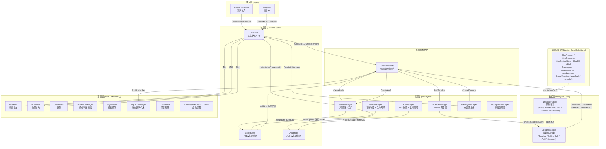
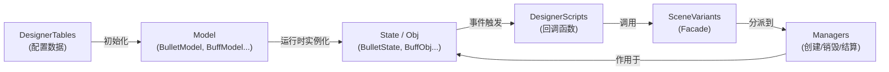

# 01 — 架构总览 (Project Overview)

> **项目名称**: Buff In TopDown Shooter  
> **引擎**: Unity (MonoBehaviour 体系)  
> **语言**: C#  
> **类型**: 俯视角射击 (Top-Down Shooter) / ARPG Demo  
> **第三方依赖**: **无**（纯 Unity 内置 API，零第三方插件）

---

## 一、核心目的

本项目是一个 **教学/演示级** 的俯视角射击（ARPG）Demo，其核心目的 **不是** 做一个完整可发布的游戏，而是：

> **用一个麻雀虽小但五脏俱全的战斗系统，演示如何在 Unity 中构建一套 "程序员写框架、策划填数据/脚本" 的 数据驱动战斗架构。**

具体来说，它展示了：

1. **Buff / Skill / Bullet / AoE / DamageInfo / Timeline** 六大核心战斗子系统如何协同工作。  
2. **"Model（策划填表）+ Script（策划脚本逻辑）+ State（运行时状态）"** 的三层数据-逻辑分离思想。  
3. 如何让策划通过 **「填表 + 注册回调函数」** 的方式独立定义新技能 / Buff / 子弹行为，而 **不需要修改任何框架代码**。

---

## 二、系统架构图

### 2.1 总体分层架构 (Mermaid)



### 2.2 一次技能释放的完整调用链

```
玩家按键 (PlayerController.FixedUpdate)
  └─ ChaState.CastSkill("fire")
       ├─ 检查 controlState / cooldown / resource
       ├─ 遍历所有 Buff 的 onCast 回调（可能替换 Timeline）
       ├─ 扣除资源
       └─ SceneVariants.CreateTimeline(timeline)
            └─ TimelineManager.AddTimeline()
                 └─ FixedUpdate 逐帧驱动 TimelineNode
                      ├─ t=0.00s SetCasterControlState（禁止移动/技能）
                      ├─ t=0.00s CasterPlayAnim("Fire")
                      ├─ t=0.10s PlaySightEffectOnCaster（枪口闪光）
                      ├─ t=0.10s FireBullet → GameManager.CreateBullet()
                      │    └─ BulletState.InitByBulletLauncher()
                      │         └─ BulletManager.FixedUpdate 每帧驱动：
                      │              ├─ 调用 Tween 函数计算移动
                      │              ├─ 碰撞检测(圆形 vs 圆形)
                      │              └─ onHit → SceneVariants.CreateDamage()
                      │                   └─ DamageManager.DealWithDamage()
                      │                        ├─ 攻击者 Buff.onHit 回调
                      │                        ├─ 防御者 Buff.onBeHurt 回调
                      │                        ├─ 可能触发 onKill / onBeKilled
                      │                        ├─ ChaState.ModResource (扣血)
                      │                        └─ PopUpNumber (跳字)
                      └─ t=0.50s SetCasterControlState（恢复控制）
```

---

## 三、目录结构详解

```
Assets/Scripts/
│
├── GameManager.cs          ★ 总管理器：工厂方法（创建角色/子弹/AoE/特效）+ 场景初始化
├── TimelineManager.cs      ★ Timeline 调度器：逐帧驱动所有 TimelineObj
├── BulletManager.cs        ★ 子弹管理器：移动 + 碰撞 + 生命周期
├── AoeManager.cs           ★ AoE 管理器：移动 + 进出检测 + 生命周期
├── DamageManager.cs        ★ 伤害管线：接收 DamageInfo → 走完 Buff 回调链 → 扣血
├── MobSpawnManager.cs        刷怪管理器：周期性检查并补充敌人
├── CamFollow.cs              镜头跟随
│
├── Character/                ═══ 角色相关 ═══
│   ├── ChaState.cs         ★ 角色状态中枢（属性/Buff/技能/移动指令/死亡）
│   ├── PlayerController.cs   玩家输入 → ChaState 指令
│   ├── SimpleAI.cs           简易敌人 AI
│   └── ChaPie.cs             血条饼图控制
│
├── Bullet/
│   └── BulletState.cs      ★ 子弹运行时状态（Model/速度/轨迹/命中记录/跟踪目标）
│
├── AoE/
│   └── AoeState.cs         ★ AoE 运行时状态（Model/半径/进出列表/Tween）
│
├── Structs/                  ═══ 纯数据结构定义（Model / Launcher / Info）═══
│   ├── AnimInfo.cs           动画信息（key → 动画名 + 权重 + 时长）
│   ├── GameTimeline.cs       TimelineModel / TimelineNode / TimelineObj / TimelineGoTo
│   ├── Line.cs               线段工具
│   ├── LogicCollider2D.cs    自定义逻辑碰撞
│   ├── MapGrids.cs           地图网格（GridInfo / MapInfo：通行判断 + 碰撞修正）
│   ├── SceneVariants.cs    ★ 全局静态桥梁：所有子系统的「门面」（Facade）
│   ├── Utils.cs              数学工具（圆/矩形碰撞、方向后缀计算）
│   │
│   ├── Character/
│   │   ├── ChaProperty.cs    角色数值属性（HP/攻击/移速/行动速度/体型…）+ 运算符重载
│   │   ├── ChaControlState.cs 操控状态（能否移动/转身/用技能）
│   │   ├── ChaSkill.cs       SkillObj + SkillModel（技能模板）
│   │   ├── Buff.cs           AddBuffInfo / BuffObj / BuffModel + 全套回调委托
│   │   ├── MoveInfo.cs       MovePreorder（强制位移信息）
│   │   ├── PlayerItem.cs     物品（预留）
│   │   └── PlayerEquipment.cs 装备（预留）
│   │
│   ├── Battle/
│   │   ├── DamageInfo.cs     DamageInfo / Damage / DamageInfoTag
│   │   └── Bullet.cs         BulletLauncher / BulletModel + 全套回调委托
│   │
│   └── AoE/
│       └── Aoe.cs            AoeLauncher / AoeModel + 全套回调委托
│
├── GameData/                 ═══ 策划数据 & 策划脚本 ═══
│   ├── DesignerTables/       ★ 策划填表（静态 Dictionary，相当于「配置表」）
│   │   ├── Skill.cs            技能表
│   │   ├── Bullet.cs           子弹表
│   │   ├── Buff.cs             Buff 表
│   │   ├── Aoe.cs              AoE 表
│   │   ├── Timeline.cs         Timeline 表
│   │   └── Animation.cs        动画信息表
│   │
│   └── DesignerScripts/      ★ 策划脚本（回调函数的具体实现）
│       ├── Timeline.cs         Timeline 节点可调用的所有函数
│       ├── Bullet.cs           子弹的 onCreate/onHit/onRemoved/tween/targetting
│       ├── Buff.cs             Buff 的 onOccur/onTick/onRemoved/onCast/onHit/onBeHurt...
│       ├── Aoe.cs              AoE 的 onCreate/onRemoved/onTick/onChaEnter/onBulletEnter/tween...
│       └── Common.cs           公共规则（DamageValue 计算公式）
│
├── Unit/                     ═══ 通用表现组件（角色/子弹/AoE 共用）═══
│   ├── UnitMove.cs             物理移动（含碰撞修正）
│   ├── UnitRotate.cs           平滑旋转
│   ├── UnitAnim.cs             动画播放（优先级机制）
│   ├── UnitBindManager.cs      绑点管理器
│   ├── UnitBindPoint.cs        单个绑点
│   ├── UnitRemover.cs          延迟销毁
│   └── ViewContainer.cs        视觉容器（挂载模型/特效的子 GameObject）
│
├── UI/                       ═══ UI 相关 ═══
│   ├── PopTextManager.cs       弹出数字/文字管理
│   ├── UnitPopText.cs          单条弹出文本
│   ├── PlayerStateListener.cs  玩家 HP 条绑定
│   └── PieChartController.cs   饼图血条渲染
│
└── SightEffect/              ═══ 视觉特效辅助 ═══
    ├── SightEffect.cs          特效基础信息（duration）
    ├── BallRolling.cs          滚球表现动画
    ├── BouncingBallY.cs        手雷弹跳 Y 轴动画
    └── RotateY.cs              Y 轴旋转效果
```

---

## 四、核心设计模式分析

### 4.1 Manager 单体模式（准单例）

| 模式 | 说明 |
|------|------|
| **实现方式** | 所有 Manager（`GameManager` / `TimelineManager` / `BulletManager` / `AoeManager` / `DamageManager` / `MobSpawnManager`）都是挂在场景中唯一 GameObject 上的 `MonoBehaviour`，场景中只有一份实例。 |
| **访问方式** | 不是经典的 `Singleton.Instance`，而是通过 `GameObject.Find("GameManager").GetComponent<T>()` 获取，被统一封装在 `SceneVariants` 静态类中。 |
| **优点** | 简单直接，不需要泛型单例基类。 |
| **缺点** | 每次调用都有 `Find` 的开销（Demo 可接受，生产项目应缓存引用）。 |

### 4.2 门面模式 (Facade) — `SceneVariants`

`SceneVariants` 是整个项目中 **最重要的"胶水类"**：

```csharp
// 任何地方想创建子弹？
SceneVariants.CreateBullet(bulletLauncher);
// 任何地方想造成伤害？
SceneVariants.CreateDamage(attacker, target, damage, degree, critRate, tags);
// 任何地方想创建 Timeline？
SceneVariants.CreateTimeline(timelineModel, caster, source);
```

它将所有 Manager 的能力聚合为一组静态方法，让 **策划脚本层（DesignerScripts）不需要知道任何 Manager 的存在**，只需要调用 `SceneVariants.XXX()` 即可。

### 4.3 数据驱动 + 回调委托模式

这是本项目 **最核心的架构思想**。以 `BulletModel` 为例：

```csharp
public struct BulletModel {
    public string id;
    public string prefab;
    public BulletOnCreate onCreate;     // 委托：创建时做什么
    public BulletOnHit onHit;           // 委托：命中时做什么
    public BulletOnRemoved onRemoved;   // 委托：消亡时做什么
    public object[] onHitParams;        // 参数：传给回调函数的数据
    // ...
}
```

**策划填表时**，通过字符串映射从 `DesignerScripts.Bullet` 的字典中取出对应函数：

```csharp
// DesingerTables.Bullet.cs
{"normal1", new BulletModel("normal1", "NormalBullet0",
    onHit: "CommonBulletHit",           // 字符串 → 查字典 → 委托
    onHitParams: new object[]{1.0f, 0.05f, "Effect/HitEffect_A"},
    // ...
)}
```

**这套模式在 Buff / AoE / Timeline 中完全一致：**

| 系统 | Model (填表) | Script (脚本逻辑) | State (运行时) | Manager (驱动) |
|------|-------|--------|-------|---------|
| 子弹 | `BulletModel` | `DesignerScripts.Bullet` | `BulletState` | `BulletManager` |
| AoE | `AoeModel` | `DesignerScripts.AoE` | `AoeState` | `AoeManager` |
| Buff | `BuffModel` | `DesignerScripts.Buff` | `BuffObj` | `ChaState` (内置) |
| 技能 | `SkillModel` | — (技能效果走 Timeline) | `SkillObj` | `ChaState` (内置) |
| Timeline | `TimelineModel` | `DesignerScripts.Timeline` | `TimelineObj` | `TimelineManager` |
| 伤害 | `DamageInfo` | `DesignerScripts.CommonScripts` | — | `DamageManager` |

### 4.4 Timeline 驱动模式（帧事件队列）

`Timeline` 不是 Unity 的 Timeline！它是一个 **自定义的帧事件调度器**：

```
TimelineModel {
    nodes: [
        {time: 0.00s, event: "SetCasterControlState", params: [true, true, false]},
        {time: 0.10s, event: "FireBullet",             params: [bulletLauncher]},
        {time: 0.50s, event: "SetCasterControlState", params: [true, true, true]},
    ],
    duration: 0.50s,
    chargeGoBack: {atTime: 0.3s, gotoTime: 0.2s}  // 蓄力跳转
}
```

- `TimelineManager` 在 `FixedUpdate` 中推进每个 `TimelineObj` 的时间。
- 当时间越过某个 `TimelineNode` 时，执行对应的回调函数。
- 支持 **蓄力循环**（`chargeGoBack`）：当 caster 的 `charging == true` 时，时间指针会跳回。

### 4.5 属性叠加公式

```csharp
// ChaState.AttrRecheck()
finalProp = (baseProp + equipmentProp + buffProp[0]) * buffProp[1]
//           基础属性   装备属性         Buff加法叠加     Buff乘法叠加
```

`ChaProperty` 重载了 `+` 和 `*` 运算符，`*` 的语义是百分比增幅（`value * (1 + modifier)`），而非直接相乘。

### 4.6 伤害流水线 (Damage Pipeline)

```
DamageInfo 创建
  → 攻击者所有 Buff 的 onHit 回调（可修改 DamageInfo）
  → 防御者所有 Buff 的 onBeHurt 回调（可修改 DamageInfo）
  → 判断是否致死
  → 是 → 攻击者 Buff.onKill + 防御者 Buff.onBeKilled
  → 否 → 扣血 + 可能播放受伤动画
  → 跳数字
  → DamageInfo.addBuffs → 给角色添加 Buff
```

---

## 五、六大子系统职责速查表

| 子系统 | 核心职责 | 驱动方式 |
|--------|---------|---------|
| **Character (ChaState)** | 角色的"大脑"：属性计算、Buff 管理、技能释放、移动/旋转/动画的指令分发 | 自身 `FixedUpdate` |
| **Timeline** | 技能/技能效果的 "导演"：按时间线编排事件（播放动画、发射子弹、创建 AoE、强制位移…） | `TimelineManager.FixedUpdate` |
| **Bullet** | 弹道系统：子弹移动（含 Tween 轨迹）、碰撞检测、命中逻辑 | `BulletManager.FixedUpdate` |
| **AoE** | 区域效果：进入/离开检测（角色 & 子弹）、周期 Tick、Tween 移动 | `AoeManager.FixedUpdate` |
| **Damage** | 伤害结算：Buff 回调链 → 最终扣血，是整个战斗系统的"裁判" | `DamageManager.FixedUpdate` |
| **Buff** | 角色增益/减益：属性修改 + 控制状态修改 + 8 种回调时机全覆盖 | `ChaState.FixedUpdate` (管理生命周期) |

---

## 六、关键数据流向总结



**总结一句话**：  
> 策划通过 **填表（DesignerTables）** 定义"这是什么"，通过 **注册脚本函数（DesignerScripts）** 定义"发生了什么事做什么"，程序框架（Managers + State）负责 **在正确的时机驱动正确的回调**。策划新增技能/Buff/子弹/AoE 时，只需要在 `DesignerTables` 新增条目 + 在 `DesignerScripts` 新增/复用回调函数，**不需要修改任何框架代码**。

---

## 七、第三方库 / 插件

| 名称 | 说明 |
|------|------|
| **无** | 本项目是纯 Unity 内置 API 实现，没有使用任何第三方插件、Asset Store 资源包或 NuGet 包。所有碰撞检测、移动、动画管理都是手写逻辑。 |

---

*下一章: `02_核心系统详解.md` — 将逐个深入每个子系统的内部实现细节。*
