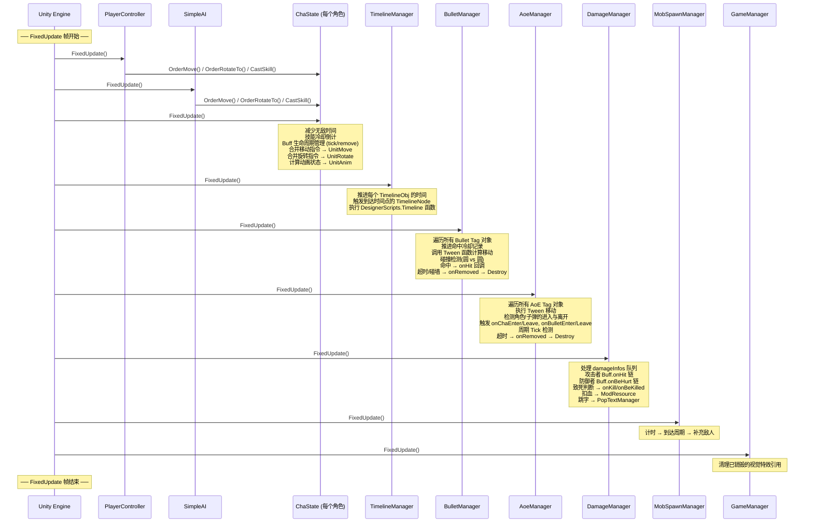

# 02 — 核心主线与游戏循环 (Main Execution Flow & Game Loop)

---

## 一、入口点：`GameManager.Start()`

Unity 没有传统意义上的 `main()` 函数。本项目的入口点是场景 `GameMain.unity` 中挂载在 `GameManager` 游戏对象上的 **`GameManager.Start()`** 方法。

### 1.1 启动序列（逐行拆解）

```
GameManager.Start()
│
├─ ① 获取场景根节点
│     root = GameObject.Find("GameObjectLayer")
│
├─ ② 随机生成地图
│     SceneVariants.RandomMap(width, height)   // 用柏林噪声生成草地/水地
│     CreateMapGameObjects()                    // 将 GridInfo 实例化为 Prefab
│
├─ ③ 创建主角
│     mainCharacter = CreateCharacter("FemaleGunner", side=1, ...)
│     │  └─ 内部流程：
│     │       Instantiate("Prefabs/Character/CharacterObj")  // 空壳：ChaState + Unit 系列组件
│     │       ChaState.InitBaseProp(baseProp)                // 设定基础属性 → AttrRecheck → 填满血量
│     │       ChaState.SetView("Prefabs/Character/FemaleGunner")  // 挂载视觉模型到 ViewContainer
│     │
│     mainCharacter.AddComponent<PlayerController>()   // 挂载玩家输入控制器
│
├─ ④ 绑定镜头 & UI
│     CamFollow.SetFollowCharacter(mainCharacter)
│     PlayerStateListener.playerGameObject = mainCharacter
│
├─ ⑤ 学习技能（共 8 个）
│     ChaState.LearnSkill(DesingerTables.Skill.data["fire"])
│     ChaState.LearnSkill(DesingerTables.Skill.data["roll"])
│     ChaState.LearnSkill(DesingerTables.Skill.data["spaceMonkeyBall"])
│     ChaState.LearnSkill(DesingerTables.Skill.data["homingMissle"])
│     ChaState.LearnSkill(DesingerTables.Skill.data["cloakBoomerang"])
│     ChaState.LearnSkill(DesingerTables.Skill.data["teleportBullet"])
│     ChaState.LearnSkill(DesingerTables.Skill.data["grenade"])
│     ChaState.LearnSkill(DesingerTables.Skill.data["explosiveBarrel"])
│     │
│     └─ LearnSkill 内部：
│          skills.Add(new SkillObj(skillModel))
│          如果 skillModel.buff != null → 为角色添加被动 Buff
│          （例如 "fire" 附带 "AutoCheckReload" Buff，用于自动换弹）
│
└─ ⑥ MobSpawnManager 开始刷怪（独立 FixedUpdate 驱动）
```

> **关键认知**：场景中有多个 Manager 组件，但没有一个统一的"引导类（Bootstrapper）"来编排初始化顺序。所有 Manager 都是各自独立的 `MonoBehaviour`，依靠 Unity 的 `Start()` / `FixedUpdate()` 各自启动。`GameManager.Start()` 是最重要的那个——它创建了地图、主角和所有初始状态。

---

## 二、游戏主循环（Game Loop）

本项目的所有核心逻辑都运行在 **`FixedUpdate`**（物理帧，默认 0.02s = 50fps）中，而非 `Update`。

### 2.1 每个 FixedUpdate 帧中各系统的执行概览



### 2.2 执行顺序的重要说明

> **⚠️ Unity 不保证 MonoBehaviour 之间的 `FixedUpdate` 执行先后！**

本项目并没有使用 `Script Execution Order` 来强制排列。在大多数情况下这不成问题，因为：

- **输入层**（PC/AI）只是"下单"（写入 `moveOrder` / 调用 `CastSkill`），不会立即产生效果。
- **状态层**（ChaState）读取这些指令并分发，但产出的 DamageInfo 被丢进队列。
- **DamageManager** 在自己的 `FixedUpdate` 中批量处理队列。

这种"**指令 → 队列 → 批量处理**"的模式天然解决了大部分顺序依赖。但如果你要做更复杂的系统，建议显式控制执行顺序。

---

## 三、核心数据的生命周期

### 3.1 角色 (Character) 的一生

```
CreateCharacter()
  ├─ Instantiate CharacterObj (空壳 Prefab)
  ├─ ChaState.InitBaseProp() → AttrRecheck() → 填满血量
  ├─ ChaState.SetView() → 挂载视觉模型
  ├─ [可选] AddComponent<PlayerController>() 或 AddComponent<SimpleAI>()
  ├─ [可选] LearnSkill() → skills 列表增长 + 被动 Buff 添加
  │
  ├─ ── 运行中 ──
  │  每帧 FixedUpdate:
  │    ├─ Buff 倒计时、Tick、移除
  │    ├─ 技能冷却倒计
  │    ├─ 接收输入指令 → 移动/旋转/动画
  │    └─ 受到 DamageInfo → ModResource → (hp<=0 → Kill())
  │
  └─ Kill()
       ├─ dead = true
       ├─ UnitAnim.Play("Dead")
       └─ [非主角] AddComponent<UnitRemover>(5s) → 5 秒后 Destroy
```

### 3.2 子弹 (Bullet) 的一生

```
SceneVariants.CreateBullet(BulletLauncher)
  └─ GameManager.CreateBullet()
       ├─ Instantiate BulletObj (空壳 Prefab)
       └─ BulletState.InitByBulletLauncher()
            ├─ 复制 Model / speed / duration / tween ...
            ├─ 记录 propWhileCast (发射时角色的属性快照)
            ├─ 挂载视觉 Prefab 到 ViewContainer
            └─ 调用 targetFunc 选择跟踪目标
  
  ── BulletManager.FixedUpdate 每帧 ──
  │  timeElapsed == 0 → onCreate 回调
  │  更新 hitRecords 冷却
  │  调用 tween(timeElapsed) → SetMoveForce → UnitMove.MoveBy
  │  碰撞检测：
  │    遍历所有 Character Tag
  │    圆形判定 (bulletRadius + chaHitRadius)
  │    命中 → hp -= 1, onHit 回调
  │    hp == 0 → Destroy
  │  duration 倒计时
  │  duration <= 0 或碰墙 → onRemoved 回调 → Destroy
```

### 3.3 AoE 的一生

```
SceneVariants.CreateAoE(AoeLauncher)
  └─ GameManager.CreateAoE()
       ├─ Instantiate AoeObj
       └─ AoeState.InitByAoeLauncher()

  ── AoeManager.FixedUpdate 每帧 ──
  │  Tween 移动
  │  justCreated → 捕获范围内角色/子弹 → onCreate 回调
  │  已创建 → 差量检测进出：
  │    角色离开 → onChaLeave
  │    角色进入 → onChaEnter
  │    子弹离开 → onBulletLeave
  │    子弹进入 → onBulletEnter
  │  duration 倒计时
  │  duration <= 0 或碰墙 → onRemoved → Destroy
  │  存活中 → 检查 onTick 周期
```

### 3.4 技能释放 → Timeline → 子弹 的完整链路

以玩家按下"开火"按钮为例：

```
[第 N 帧] PlayerController.FixedUpdate()
  └─ Input.GetButton("Fire1") == true
       └─ ChaState.CastSkill("fire")
            ├─ 检查 controlState.canUseSkill → true
            ├─ 查找 SkillObj("fire") → cooldown == 0 → OK
            ├─ 检查资源 resource.Enough(cost: ammo=1) → true
            ├─ 创建 TimelineObj(model: "skill_fire")
            ├─ 遍历 Buff.onCast:
            │    AutoCheckReload.onCast → ReloadAmmo():
            │      如果 ammo 足够 → 返回原 timeline
            │      如果 ammo 不够 → 返回 "skill_reload" timeline (换弹)
            ├─ 扣除资源: ammo -= 1
            ├─ SceneVariants.CreateTimeline(timeline)
            │    └─ TimelineManager.AddTimeline()
            └─ cooldown = 0.1s (GCD)

[第 N+? 帧] TimelineManager.FixedUpdate()
  │  timeline.timeElapsed += deltaTime * timeScale
  │
  │  t >= 0.00s:
  │    SetCasterControlState(canMove=true, canRotate=true, canSkill=false)
  │    CasterPlayAnim("Fire")
  │
  │  t >= 0.10s:
  │    PlaySightEffectOnCaster("Muzzle", "Effect/MuzzleFlash")
  │    FireBullet(BulletLauncher{model:"normal0", speed:6, dur:10})
  │      └─ SceneVariants.CreateBullet() → 子弹出现在场景中
  │
  │  t >= 0.50s:
  │    SetCasterControlState(canMove=true, canRotate=true, canSkill=true)  // 恢复控制
  │    timeline 结束，从列表移除

[第 N+?? 帧] BulletManager.FixedUpdate()
  │  子弹飞行中...
  │  碰撞检测: 命中敌人
  │    onHit → CommonBulletHit()
  │      └─ SceneVariants.CreateDamage(attacker, target, damage, degree, critRate, tags)
  │           └─ DamageManager.DoDamage() → damageInfos 队列新增一条

[第 N+?? 帧] DamageManager.FixedUpdate()
  │  DealWithDamage(damageInfo)
  │    ├─ 攻击者 Buff.onHit (无)
  │    ├─ 防御者 Buff.onBeHurt (无，如果有护甲buff会在这里生效)
  │    ├─ CanBeKilled? → 如果是 → onKill / onBeKilled
  │    ├─ ModResource(扣血)
  │    ├─ PopUpNumber(跳字)
  │    └─ addBuffs → 给对应角色添加Buff（如果有）
```

---

## 四、FixedUpdate 驱动的"心跳节拍"

将所有系统画在同一条时间轴上，你会看到一个清晰的"心跳节拍"：

```
时间 ─────────────────────────────────────────────────►
      │── 帧 N ──│── 帧 N+1 ──│── 帧 N+2 ──│
      │           │             │             │
输入   │ PC/AI     │ PC/AI       │ PC/AI       │  ← 发出指令
      │ 下单      │ 下单        │ 下单        │
      │           │             │             │
状态   │ ChaState  │ ChaState    │ ChaState    │  ← Buff管理 + 指令分发
      │ tick      │ tick        │ tick        │
      │           │             │             │
时间线 │ Timeline  │ Timeline    │ Timeline    │  ← 推进时间轴，触发事件
      │ tick      │ tick        │ tick        │
      │           │             │             │
子弹   │ Bullet    │ Bullet      │ Bullet      │  ← 移动 + 碰撞检测
      │ tick      │ tick        │ tick        │
      │           │             │             │
区域   │ AoE       │ AoE         │ AoE         │  ← 移动 + 进出检测
      │ tick      │ tick        │ tick        │
      │           │             │             │
伤害   │ Damage    │ Damage      │ Damage      │  ← 批量结算伤害队列
      │ flush     │ flush       │ flush       │
```

每一帧，每个系统各自做一小步工作。宏观来看：
- **输入层产生「意图」**
- **状态层翻译为「指令」**
- **事件层（Timeline/Bullet/AoE）产生「效果」**
- **结算层（Damage）执行「结果」**

这是一种经典的 **「帧驱动 + 消息队列」** 游戏循环架构。

---

*下一章: `03_学习路线图.md` — 分四个阶段的闯关式学习计划。*
